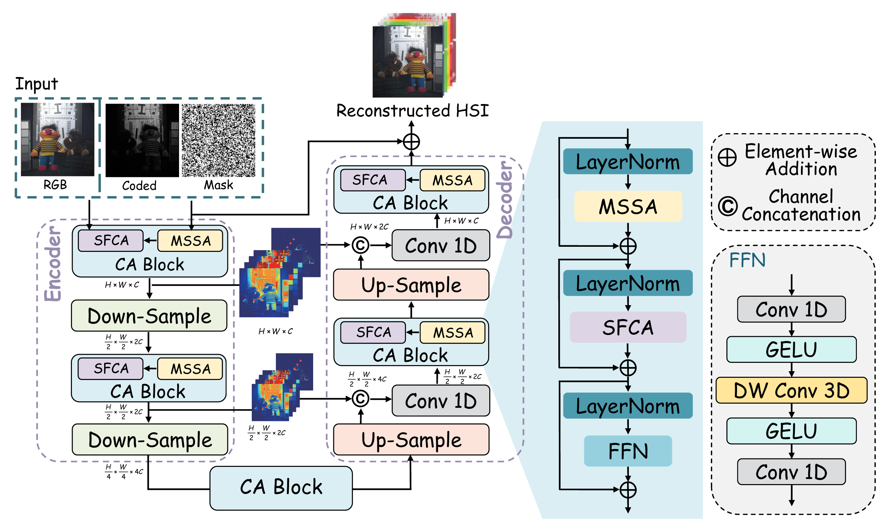

<div align="center">
<h1>CasFormer: Cascaded Transformers for Fusion-aware Computational Hyperspectral Imaging</h1>
  
Chenyu Li, [Bing Zhang](https://scholar.google.com/citations?user=nHup8tQAAAAJ&hl=en), [Danfeng Hong](https://scholar.google.com/citations?hl=en&user=n7gL0_IAAAAJ&view_op=list_works&sortby=pubdate), [Jun Zhou](https://scholar.google.com.au/citations?user=6hOOxw0AAAAJ&hl=en), [Gemine Vivone](https://scholar.google.com/citations?user=sjb_uAMAAAAJ&hl=en), [Shutao Li](https://scholar.google.com/citations?user=PlBq8n8AAAAJ&hl=en), [Jocelyn Chanussot](https://scholar.google.com/citations?user=6owK2OQAAAAJ&hl=en)

**Information Fusion: (https://doi.org/10.1016/j.inffus.2024.102408).  
</div>



**Fig.1.** The overall architecture of CasFormer with the input of RGB, coded measurement, and mask. The core module of **CasFormer** consists of a series of cascade-attention (CA) blocks, where “mask” is directly correlated with imaging devices.

## Code Running
 :anger: Before: For the required packages, please refer to detailed `.py` files;
 
 :rocket: Parameters: The trade-off parameters as `option.py*` could be better tuned and the network hyperparameters are flexible;
 
 :artificial_satellite: Results: Please see the three evaluation metrics (PSNR, SSIM, and SAM);
 
 :earth_africa: The experiments were run on 8 NVIDIA GeForce RTX 3090 GPUs.

> [!NOTE]
> - You may need to manually download the `CAVE dataset` (http://www.cs.columbia.edu/CAVE/databases/multispectral), `KAIST dataset` (https://vclab.kaist.ac.kr/siggraphasia2017p1/kaistdataset.html), and `ICVL dataset` (http://icvl.cs.bgu.ac.il/hyperspectral/).
> 
> - The pretrained model (cave_model.pth) can be downloaded from [Baidu Disk](https://pan.baidu.com/s/1G89QYQ__d7kaGXxQ2zeXoQ) with code: `d5yc` or [Google Drive](https://drive.google.com/drive/folders/14zpLtK_TGXhAcUPJVpzboHyR1AbbpcUp?usp=sharing).
>
> - Simply run `./test_code/test.py` to reproduce our method on CAVE test dataset from [Baidu Disk](https://pan.baidu.com/s/1UzuW38BGscemZebOOUmERQ) with code: `cabi` or [Google Drive](https://drive.google.com/drive/folders/1vQaPOj3oYZCq6s09useXcYvofhI6YLOD?usp=sharing).

```shell
|--CasFormer
    |--datasets
    	|-- cave_test
            |--scene1.mat
            |--scene2.mat
            ：
            |--scene10.mat
            |--mask_test.mat  
    	|-- cave_train
            |--scene1.mat
            |--scene2.mat
            ：
            |--scene20.mat
    |--simulation
    	|-- test_code
            |--model_zoo
                 |--cave_model.pth
 
```
 
## Citation Details

**Please kindly cite the papers if this code is useful and helpful for your research.**

```
@article{li2024casformer,
  title={CasFormer: Cascaded transformers for fusion-aware computational hyperspectral imaging},
  author={Li, Chenyu and Zhang, Bing and Hong, Danfeng and Zhou, Jun and Vivone, Gemine and Li, Shutao and Chanussot, Jocelyn},
  journal={Information Fusion},
  pages={102408},
  year={2024},
  publisher={Elsevier}
}
```

Licensing
---------

Copyright (C) 2024 Danfeng Hong

This program is free software: you can redistribute it and/or modify it under the terms of the GNU General Public License as published by the Free Software Foundation, version 3 of the License.

This program is distributed in the hope that it will be useful, but WITHOUT ANY WARRANTY; without even the implied warranty of MERCHANTABILITY or FITNESS FOR A PARTICULAR PURPOSE. See the GNU General Public License for more details.

You should have received a copy of the GNU General Public License along with this program.

Contact Information:
--------------------

Danfeng Hong: hongdanfeng1989@gmail.com<br>
Danfeng Hong is with the Aerospace Information Research Institute, Chinese Academy of Sciences, 100094 Beijing, China.
